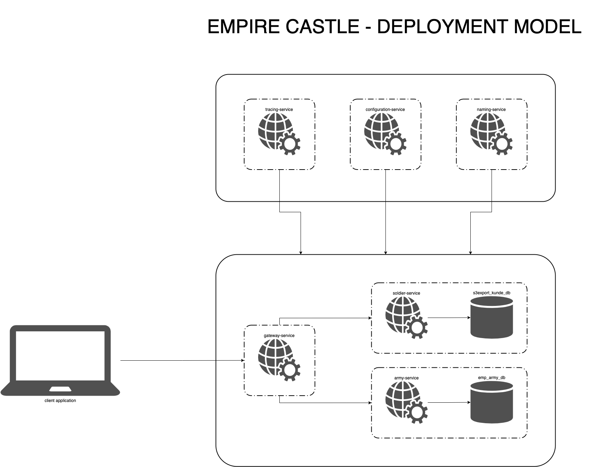
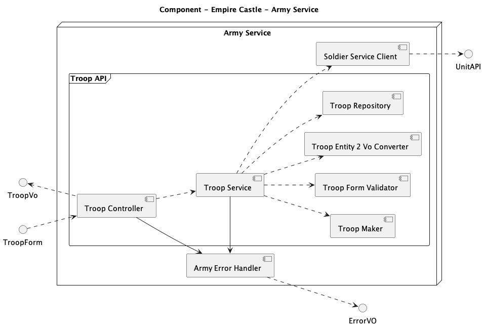
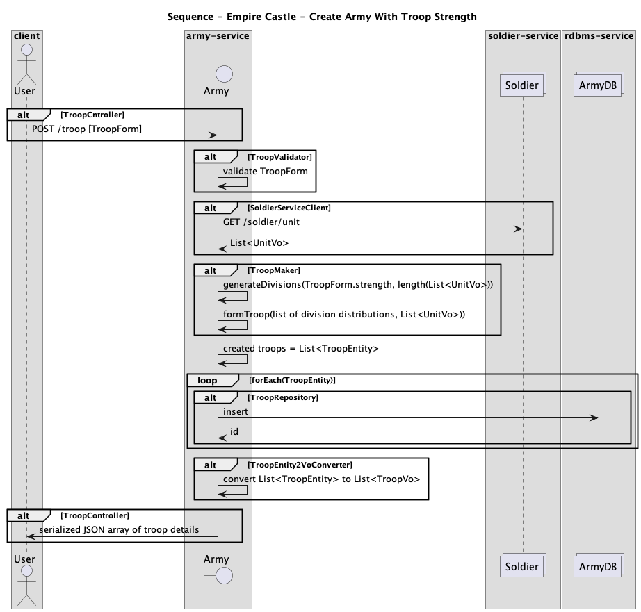

# EMPIRE CASTLE SOLUTION CHALLENGE

---
### TECHNOLOGY STACK
| Technology | Implementations/Frameworks      | Version                           | Purpose |
| ----------- |---------------------------------|-----------------------------------| ----------- |
| Java | OpenJDK HotSpot VM              | 11                                | JVM |
| Java | Spring Boot                     | 2.3.9                             | Web Services framework |
| Java | Spring Cloud                    | Hoxton                            | Microservice framework |
| Java | Fabric8                         | 0.40.0                            | Mavenized docker image creation |
| Java | TOAB Chassis SDK                | 1.8.1-SNAPSHOT                    | Personalized design patterns |
| Java | Open Zipkin                     | 2.23.2                            | Distributed tracing |
| Java | JUnit                           | 5                                 | Unit testing |
| Java | Maven                           | 3.6.x                             | Build artifacts and execute tests |
| OpenAPI | Swagger                         | 3                                 | REST API Documentation |
| RDBMS | MySQL                           | 8.0.2                             | Persistent data storage with ACID gaurantee |
| Virtualization | Docker                          | 20.10.5                           | Platform agnostic containerization |

---
### MINIMUM SYSTEM REQUIREMENTS
1. Unix based Operating System - Linux or OSX
2. Disk - 2 GB
3. Memory - 3 GB
4. Processor - 2 CPU
5. Network - 100 MBps
6. Operating System - Ubuntu 20.4/Windows 10/MacOS 10.5

---
### ENSURE THE FOLLOWING ARE AVAILABLE
1. JDK - 11
2. Python - 3.9
3. Maven - 3.6.x
4. Docker - 20.10.x
5. Docker Compose - 1.28.x
6. JAVA_HOME and MAVEN_HOME is set on the host system

---
### STEPS TO INSTALL AND RUN - DOCKER APPROACH
1. Open terminal on your host system and navigate to the location where you unzipped this project
2. Execute `mvn clean package -e -Ddocker.skip=true` at the root of this project to run the tests and build the artifacts
3. Execute `mvn docker:build -e` at the root of this project to build the docker images for the respective artifacts
4. Navigate to the location `scripts/docker/compose/linux` oder `scripts/docker/compose/osx` based on your OS, under the root of this project
5. Execute `docker-compose -f stack-1.infrastructure.yml up` at the location to start all the third party service containers for the microservice ecosystem
6. Execute `docker-compose -f stack-2.infrastructure.yml up` at the location to start all the operational service containers for the microservice ecosystem
7. Open you browser and navigate to `localhost:8761` to verify that the naming-service is available. The naming-service is called Eureka Server
8. Wait until you see Eureka server's home page. Once the naming-service is available guided by the visibility of Eureka Server's home page, continue further
9. Execute `docker-compose -f stack-3.application.yml up` at the location to start all the business service containers for the microservice ecosystem
10. Wait for all the web service containers to become available . Verify in Eureka server's dashboard if the following services are listed as UP: `GATEWAY-SERVICE, SOLDIER-SERVICE, ARMY-SERVICE`
11. Open your browser and navigate to `http://localhost:11001/soldier/swagger-ui.html` to access the OpenAPI documentation console for the soldier-service
12. Execute the API endpoint `POST /unit` once with `name: spearmen` to create soldier unit spearmen
13. Execute the API endpoint `POST /unit` twice with `name: swordsmen` to create soldier unit swordsmen
14. Execute the API endpoint `POST /unit` thrice with `name: archers` to create soldier unit archers
15. Open your browser and navigate to `http://localhost:17001/army/swagger-ui.html` to access the OpenAPI documentation console for the army-service
16. Execute the API endpoint `POST /troop` once with `strength: <integer value>` to create army with the required strength as many times as you like

---
### STEPS TO STOP - DOCKER APPROACH
1. Open terminal on your host system and navigate to the location where you unzipped this project
2. Navigate to the location `scripts/docker/compose/linux` oder `scripts/docker/compose/osx` based on your OS, under the root of this project
3. Execute `docker-compose -f stack-3.application.yml down` at the location to stop all the business service containers for the microservice ecosystem
4. Execute `docker-compose -f stack-2.infrastructure.yml down` at the location to stop all the operational service containers for the microservice ecosystem
5. Execute `docker-compose -f stack-1.infrastructure.yml down` at the location to stop all the third party service containers for the microservice ecosystem

---
### FEATURES
1. Add new soldier units
2. Read, modify or delete existing soldier units
3. Create randomized and unbiased army troops with given strength
4. Error reporting with codes and descriptive messages

---
### ARCHITECTURE

---
### COMPONENTS

---
### BUSINESS FLOWS SEQUENCES

---
### PROJECT DESCRIPTION
| SERVICE NAME          | FUNCTIONALITY                                                                                                                | TYPE |
|-----------------------|------------------------------------------------------------------------------------------------------------------------------| ----------- |
| configuration-service | Centralized configuration store for all microservices                                                                        | Maven Project |
| naming-service        | Service registration and discovery for all microservices by their name                                                       | Maven Project |
| gateway-service       | Single entry point to provided accessibility for all microservices by their API, routes request to appropriate microservices | Maven Project |
| soldier-service       | Web service endpoints to manage soldier unit details                                                                         | Maven Project |
| army-service          | Web service endpoints to manage army troop details                                                                           | Maven Project |
| rdbms-service         | Stores kunde and auftraege details, along with batch execution details and download audit logs                               | Binary |
| tracing-service       | Trace requests across microservices for debugging                                                                            | Binary |

---
### FUNCTIONAL DECISIONS
1. Soldier service has multiple endpoints to manage units since they can be more in the future or even less as well
2. Soldier data search and create APIs have been implemented for brevity
3. Soldier unit details are returned with an active field for each record since it is up to the consuming service to decide how they want to judge active/inactive units
4. Soldier spans across 3 units as of now: `Swordsmen, Spearmen, Archers`
5. Army service has endpoint to generate troops of soldier units based on required strength of army
6. Army service logs each troop creation data for audit purpose
7. Time and space complexity of generating army troops of size M is O(N) where N is the number of active soldier units in the ecosystem
8. The strength of army has to be greater than or equal to the number of available active soldier UNITS since each troop must be more than zero 
9. All internal service calls via HTTP take place through the system Gateway Service
10. Strength of army can be less than or more than the available active soldier units

---
### TECHNICAL DECISIONS
1. All web services should scale horizontally to keep up with dynamic load in favour of being high performant
2. Integration tests have been written to assert the business logic of core web services viz., soldier and army
3. Each web service is a spring boot application following the pattern of controller, service and repository, where repository can adapt to a database or an external service as per the respective microservice's use case
4. All web services have their individual exception handler to translate exceptions to HTTP error responses with appropriate HTTP status codes
5. Each infrastructure service is a spring cloud application acting as an independent standalone server
6. Functional interfaces have been defined in army microservice to perform one off business logic
7. All business specific exceptions are checked exceptions having a custom message and an enum based error code which in turn contains a predefined application specific error code in the format `EMP-<INITIALS-OF-SERVICE-NAME>-<INCREMENTING-NUMBER>` and its corresponding HTTP Status code
8. Each microservice has a REST webservice error handler that catches any business specific exception to translate them into appropriate error messages and HTTP status codes
9. Sleuth and Zipkin has been added to each of the core microservices for the purpose of tracing distributed requests across multiple microservices
10. Application specific configuration changes are loaded and propagated downstream in the order as follows: java system variables, bootstrap.properties, <APPLICATION_NAME>-<PROFILE>.yml in configuration server
11. Configuration store for all services and batches is chosen as a remote git repository for distributed management

---
### ADDITIONAL RESOURCES
1. In the `scripts` folder under the root of this project you will find the database scripts, docker compose files corresponding to this microservice setup

---
### TROUBLESHOOTING
1. If your build is failing because the artifact `com.teenthofabud.core.common:toab-chassis-sdk:1.8.1-SNAPSHOT` is missing then follow the below steps to fix it
2. Clone this project from Github: `https://github.com/anirbandas18/toab-chassis-sdk.git`
3. Open your terminal or command prompt according to your system
4. Browse to the location where you cloned out the project `toab-chassis-sdk` via terminal or command prompt
5. Execute the command `mvn clean package -e`
6. Execute the command `mvn clean install -e`
7. You should see output on your terminal or command prompt indicating that maven successfully installed the artifact `com.teenthofabud.core.common:toab-chassis-sdk:1.8.1-SNAPSHOT`.
8. This should resolve the issue of the missing artifact. Continue with the normal steps to install and run